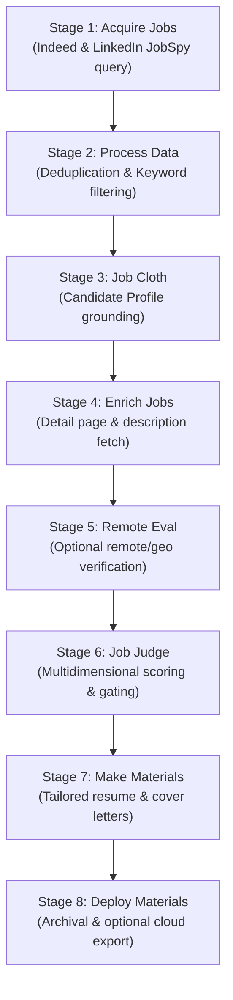

# AstroEX

[](LICENSE.md)
[](https://nodejs.org/)
[](https://github.com/sudoTni/AstroEX/tree/main#quick-start-guide)<br>
[](https://antigravity.google/)
[](https://openai.com/codex/)
[](https://opencode.ai/)
[](https://openrouter.ai)

> **AstroEX** is an autonomous, multi-phase job acquisition and tailored application materials generation engine. It combines lightweight, headless job search querying with multi-provider LLM grounding to systematically evaluate opportunities, match candidate qualifications, and produce tailored application packages.

<p align = "center"></p>

---

## Legal & Compliance Disclaimer

> [!WARNING]
> ### Legal Disclaimer & Terms of Service Notice
> AstroEX is provided strictly for educational, research, and personal productivity purposes.
> 
> Scraping job board platforms (including LinkedIn, Indeed, and others) may be subject to the respective platforms' Terms of Service, User Agreements, robots.txt directives, and applicable local laws. The developers and contributors of AstroEX:
> 1. Do not encourage, endorse, or promote unauthorized automated scraping, rate-limit evasion, or commercial extraction of proprietary data.
> 2. Assume no liability for account restrictions, IP blocks, CAPTCHA challenges, legal claims, or service suspensions resulting from the use of this software.
> 3. Urge all users to employ reasonable request throttling, respect robots.txt guidelines, and utilize official developer APIs whenever available for commercial or high-volume workflows.
> 
> You are solely responsible for ensuring that your execution of AstroEX complies with all relevant terms of service, platform guidelines, and legal requirements.

---

## Core Pipeline Architecture

AstroEX organizes job application automation into 8 decoupled, cache-backed pipeline stages:



1. **Acquire Jobs**: Headless querying of LinkedIn and Indeed utilizing resilient HTTP session retry policies, TLS impersonation headers, and pagination handlers.
2. **Process Data**: Normalizes listings, removes blocklisted companies and titles, and filters out previously seen opportunities via SQLite.
3. **Job Cloth**: Reconciles raw job requirements against the candidate's skills and background.
4. **Enrich Jobs**: Fetches complete long-form job descriptions and employer profiles.
5. **Remote Eval**: Evaluates residency requirements, time zones, and remote eligibility rules.
6. **Job Judge**: Evaluates opportunities against candidate-defined gates (seniority, compensation, tech stack match) to generate a fit score (0–100).
7. **Make Materials**: Generates tailored resumes and cover letters for qualified opportunities.
8. **Deploy Materials**: Packages materials into formatted markdown files, JSON deployment payloads, and optional cloud storage sync via Google Apps Script.

---

## LLM Provider Support & Model Caveats

> [!NOTE]
> AstroEX supports **OpenRouter** as well as direct **OpenAI-Compatible** endpoints (including local Ollama, vLLM, LM Studio, and Groq).
> 
> - **Prompt Adherence & JSON Formatting:** High-parameter reasoning models (e.g. Claude 3.5 Sonnet, GPT-4o) reliably produce valid schema-compliant JSON during the `jobCloth` and `jobJudge` phases. Smaller local models (7B or 8B parameters) may occasionally omit required delimiters or hallucinate keys.
> - **Context Windows:** Ensure your local LLM server context window is configured for at least 16,000 tokens to handle full resume inventories and lengthy job postings without silent truncation.
> - **Mini Prompt Presets:** Use `--preset mini` or specific mini preset variants (`prompts/*-mini.txt`) for faster inference, reduced token usage, and lower API costs.

---

## Quick Start Guide

> [!NOTE]
> The AEX contributors highly recommend the use of a codex / AI coding assistant for rapidly porting to your platform and configuring the software with your application materials!

### 1. Prerequisites
- **Node.js**: `>= 22.13.0`
- **npm**: `>= 10.0.0`

### 2. Installation
```bash
git clone https://github.com/sudoTni/AstroEX.git
cd AstroEX
npm install
npm run build
```

### 3. Candidate Profile Setup
AstroEX decouples private profile data from the codebase. Copy the example profile template to your own private profile directory:
```bash
cp -r profile.example profile
```

Customize the files in `profile/` with your information:
- `my_resume.txt`: Plain-text comprehensive resume.
- `my_professional_title.txt`: Primary professional title.
- `my_professional_summary.txt`: Executive summary or elevator pitch.
- `my_key_skills.txt`: Comma-separated list of core competencies.
- `my_testimonials.txt`: Quotes or excerpts from performance reviews.
- `search_terms.txt`: Target job titles (one per line).
- `company_filters.txt`: Company names or agencies to exclude.
- `title_filters.txt`: Negative title keywords to reject (e.g. Intern, Director).

### 4. Environment Configuration
Copy `.env.example` to `.env`:
```bash
cp .env.example .env
```

Configure your LLM API key:
```env
# For OpenRouter:
AEX_OR_API_KEY=sk-or-v1-...

# OR for OpenAI / Local LLM:
OPENAI_API_KEY=sk-...
# OPENAI_BASE_URL=http://localhost:11434/v1
```

### 5. Running the Pipeline
Run the full 8-phase pipeline:
```bash
node dist/index.js run-pipeline \
  --job-provider indeed,linkedin \
  --search-terms-file profile/search_terms.txt \
  --results-wanted 50 \
  --remote-only
```

Or execute using the provided wrapper script:
```bash
./astroex_wrapper.bash
```

---

## CLI Command Reference

All subcommands support `--help` for comprehensive option listings.

| Command | Description |
| :--- | :--- |
| `run-pipeline` | Execute the complete end-to-end 8-phase acquisition and materials generation pipeline |
| `acquire-jobs` | Query job board platforms (Indeed, LinkedIn) and write raw acquired listings |
| `processData` | Filter acquired listings by company, title, and database deduplication |
| `jobCloth` | Ground job descriptions against candidate profile data |
| `enrich-jobs` | Fetch detailed long-form descriptions and company metadata |
| `jobJudge` | Score and filter jobs based on candidate gates and alignment rules |
| `makeMaterials` | Generate optimized, tailored resumes and cover letters for qualified opportunities |
| `preflight` | Validate system prerequisites, runtime paths, API keys, and model presets |
| `jobDb` | Query, vacuum, and inspect the local SQLite deduplication repository |
| `artifact` | Verify checksums and validate artifact manifests |

### Global Flags
- `--verbose`, `-v`: Enable verbose debug logging output.
- `--no-color`: Disable ANSI terminal coloring and gradient banners.
- `--json`: Output machine-readable JSON records.
- `--log-level <level>`: Set minimum log level (`trace`, `debug`, `info`, `warn`, `error`).

---

## Google Apps Script Deployment

For automated document generation in Google Drive and Google Docs:
1. Open [Google Apps Script](https://script.google.com/) and create a new project.
2. Copy the contents of [`deployMaterials.gs`](deployMaterials.gs) into your script editor.
3. In Project Settings -> Script Properties, configure:
   - `DEFAULT_DOC_LOG_FOLDER_ID`: Your Google Drive Folder ID.
4. Deploy as an API Executable or run directly to sync generated materials into styled Google Docs.

---

## Third-Party Notices & Attribution

AstroEX is licensed under the [MIT License](LICENSE.md).

This project incorporates adapted algorithms and code from upstream open-source projects:
- **`ts-jobspy`** (Copyright 2025-2026 Alpha Romer Coma, MIT License)
- **`JobSpy`** (Copyright 2023 Cullen Watson, Zachary Hampton, MIT License)
- **`linkedin-jobs-scraper`** (Copyright 2023 llpujol, MIT License)

See [THIRD_PARTY_NOTICES.md](THIRD_PARTY_NOTICES.md) for full license texts and copyright notices.
