# AstroEX Statistics Framework Design

## Overview

This document outlines a comprehensive statistics framework for AstroEX to ensure that every command includes comprehensive, relevant statistics. The current system has basic performance monitoring but lacks consistent, detailed statistics across all commands.

## Current State Analysis

### Existing Statistics Capabilities
- **Performance monitoring**: Basic timing and memory tracking via `performance.ts`
- **Command-specific stats**: Limited and inconsistent across commands
- **JobJudge**: Has timing metrics and success/failure tracking
- **JobCloth**: Has batch processing stats and circuit breaker metrics
- **ProcessData**: Has file processing and duplicate removal stats
- **ScrapeJobs**: Has basic URL counting and timing

### Gaps Identified
1. **Inconsistent reporting**: Different commands report different metrics
2. **Limited scope**: Missing comprehensive resource usage, API usage, and error statistics
3. **No aggregation**: No summary reports across operations
4. **Limited formatting**: Statistics only available in basic console output

## Proposed Statistics Framework

### Architecture Overview

```mermaid
graph TB
    subgraph "Statistics Collection Layer"
        A[Command Interface] --> B[Statistics Collector]
        B --> C[Performance Metrics]
        B --> D[Success/Failure Tracking]
        B --> E[Resource Usage]
        B --> F[API Usage]
        B --> G[Data Processing]
    end
    
    subgraph "Statistics Categories"
        C --> C1[Execution Time]
        C --> C2[Memory Usage]
        C --> C3[CPU Time]
        
        D --> D1[Success Rate]
        D --> D2[Failure Count]
        D --> D3[Error Categories]
        
        E --> E1[Peak Memory]
        E --> E2[Average Memory]
        E --> E3[Garbage Collection Events]
        
        F --> F1[API Calls]
        F --> F2[Retry Count]
        F --> F3[Circuit Trips]
        F --> F4[Response Times]
        
        G --> G1[Records Processed]
        G --> G2[Duplicates Removed]
        G --> G3[Files Processed]
        G --> G4[Filter Applied]
    end
    
    subgraph "Statistics Reporting Layer"
        H[Statistics Reporter] --> I[Console Output]
        H --> J[JSON Report]
        H --> K[Markdown Report]
        H --> L[CSV Export]
    end
    
    B --> H
```



## Detailed Statistics Categories

### 1. Performance Metrics
- **Total Execution Time**: Start-to-end timing
- **Operation Breakdown**: Time spent in different phases
- **Memory Usage**: Peak, average, and memory delta
- **CPU Time**: Process CPU usage
- **Garbage Collection**: GC events and impact

### 2. Success/Failure Tracking
- **Success Rate**: Percentage of successful operations
- **Total Operations**: Attempted, succeeded, failed
- **Error Categories**: Categorized by type (network, parsing, validation, etc.)
- **Error Details**: Specific error messages and stack traces
- **Recovery Attempts**: Number of retry attempts

### 3. Resource Usage Statistics
- **Memory Metrics**: Peak memory, average memory, memory delta
- **File Operations**: Files opened, closed, read, written
- **Network Resources**: Connections opened, closed, timeouts
- **System Resources**: CPU usage, thread count

### 4. API Usage Statistics
- **API Calls**: Total calls by provider and endpoint
- **Retry Statistics**: Retry attempts, success rate after retry
- **Circuit Breaker**: Trips, resets, failure rates
- **Response Times**: Min, max, average, percentiles
- **Error Rates**: By HTTP status code and error type

### 5. Data Processing Statistics
- **Volume Metrics**: Records processed, filtered, removed
- **Quality Metrics**: Validation failures, data quality issues
- **Efficiency Metrics**: Processing rate, throughput
- **Storage Metrics**: Input/output file sizes

## Implementation Strategy

### Phase 1: Core Statistics Infrastructure
1. Create unified statistics collector interface
2. Implement base statistics categories
3. Add performance monitoring integration
4. Create statistics aggregation system

### Phase 2: Command-Specific Enhancements
1. **Scrape-Jobs Command**:
   - URL processing statistics
   - Network performance metrics
   - Data extraction success rates
   - Rate limiting impact

2. **JobJudge Command**:
   - AI evaluation statistics
   - Success/failure by criteria
   - Processing time by job complexity
   - Memory usage during analysis

3. **JobCloth Command**:
   - Batch processing efficiency
   - API call optimization
   - Circuit breaker performance
   - Title matching statistics

4. **ProcessData Command**:
   - Data filtering efficiency
   - Duplicate removal statistics
   - File processing performance
   - Data transformation metrics

5. **Scrape-Search Command**:
   - Search result statistics
   - Pagination handling
   - Data parsing success rates
   - Network performance

### Phase 3: Advanced Features
1. **Real-time Statistics**: Live updates during long operations
2. **Historical Analysis**: Trend analysis across multiple runs
3. **Export Capabilities**: Multiple output formats (JSON, CSV, Markdown)
4. **Alerting**: Threshold-based alerts for performance issues

## Statistics API Design

### Core Interface
```typescript
interface StatisticsCollector {
  // Performance tracking
  startTimer(operation: string): string;
  endTimer(id: string, additionalData?: any): void;
  
  // Counters
  incrementCounter(name: string, value?: number): void;
  setCounter(name: string, value: number): void;
  
  // Metrics
  setGauge(name: string, value: number): void;
  recordHistogram(name: string, value: number): void;
  
  // Errors
  recordError(error: Error, context?: any): void;
  recordSuccess(operation: string, context?: any): void;
  
  // Aggregation
  getStatistics(): StatisticsSummary;
  export(format: 'json' | 'csv' | 'markdown'): string;
}
```

### Statistics Summary Structure
```typescript
interface StatisticsSummary {
  metadata: {
    command: string;
    startTime: string;
    endTime: string;
    duration: number;
    version: string;
  };
  performance: {
    totalExecutionTime: number;
    memoryUsage: {
      peak: number;
      average: number;
      start: number;
      end: number;
      delta: number;
    };
    cpuTime: number;
    garbageCollections: number;
  };
  operations: {
    total: number;
    successful: number;
    failed: number;
    successRate: number;
  };
  api: {
    totalCalls: number;
    retries: number;
    circuitBreakerTrips: number;
    averageResponseTime: number;
    errorRate: number;
  };
  data: {
    recordsProcessed: number;
    recordsFiltered: number;
    duplicatesRemoved: number;
    filesProcessed: number;
  };
  errors: {
    byCategory: Record<string, number>;
    details: Array<{
      timestamp: string;
      category: string;
      message: string;
      context?: any;
    }>;
  };
}
```

## Integration Guidelines

### For Command Developers
1. **Always start statistics collection** at command entry
2. **Track all major operations** with timers
3. **Count successes and failures** for each operation
4. **Record resource usage** for memory-intensive operations
5. **Categorize errors** for better analysis
6. **Export statistics** at command completion

### Best Practices
1. **Minimal overhead**: Statistics collection should not impact performance
2. **Consistent naming**: Use standardized metric names across commands
3. **Contextual data**: Include relevant context with each metric
4. **Error resilience**: Statistics collection should not fail the command
5. **Privacy compliance**: Ensure no sensitive data is logged

## Reporting Formats

### Console Output
- Human-readable summary
- Color-coded success/failure indicators
- Progress bars for long operations
- Key metrics highlighted

### JSON Export
- Machine-readable format
- Complete statistics data
- Suitable for automation and analysis
- Structured for easy parsing

### Markdown Report
- Professional documentation format
- Tables and charts for visualization
- Executive summary
- Detailed breakdown by category

### CSV Export
- Spreadsheet-compatible format
- Time-series data for analysis
- Suitable for importing into BI tools
- Flat structure for easy manipulation

## Success Metrics

### Quantitative Metrics
- 100% command coverage for statistics
- 50% reduction in debugging time
- 30% improvement in performance optimization
- 90%+ user satisfaction with statistics

### Qualitative Metrics
- Consistent reporting across all commands
- Actionable insights for users
- Improved troubleshooting capabilities
- Better performance optimization data

## Implementation Roadmap

### Week 1: Core Infrastructure
- [ ] Create statistics collector interface
- [ ] Implement base performance metrics
- [ ] Add success/failure tracking
- [ ] Create basic reporting functionality

### Week 2: Command Integration
- [ ] Enhance scrape-jobs command
- [ ] Enhance jobJudge command
- [ ] Enhance jobCloth command
- [ ] Enhance processData command

### Week 3: Advanced Features
- [ ] Add API usage statistics
- [ ] Create export capabilities
- [ ] Add real-time statistics
- [ ] Implement error categorization

### Week 4: Testing and Documentation
- [ ] Test all statistics features
- [ ] Create user documentation
- [ ] Add examples and use cases
- [ ] Performance validation

## Conclusion

This comprehensive statistics framework will transform AstroEX from having basic performance monitoring to providing detailed, actionable statistics across all operations. The framework will enable better performance optimization, improved troubleshooting, and enhanced user understanding of command execution.

The implementation will follow a phased approach to ensure minimal disruption to existing functionality while gradually adding comprehensive statistics capabilities.