# AstroEX Statistics Framework - Summary

## Project Overview

This project aims to enhance AstroEX with comprehensive, relevant statistics reporting across all CLI commands. The current system has basic performance monitoring but lacks consistent, detailed statistics that would provide users with deep insights into their command execution.

## Current State Analysis

### Existing Capabilities
- **Basic performance monitoring**: Timing and memory tracking via `performance.ts`
- **Command-specific stats**: Limited and inconsistent across commands
- **Partial error tracking**: Some commands track errors, but not comprehensively

### Identified Gaps
1. **Inconsistent reporting**: Different commands report different metrics
2. **Limited scope**: Missing comprehensive resource usage, API usage, and error statistics
3. **No aggregation**: No summary reports across operations
4. **Limited formatting**: Statistics only available in basic console output

## Solution Overview

### Architecture Design

```mermaid
graph TB
    subgraph "Statistics Collection Layer"
        A[Command Interface] --> B[Statistics Collector]
        B --> C[Performance Metrics]
        B --> D[Success/Failure Tracking]
        B --> E[Resource Usage]
        B --> F[API Usage]
        B --> G[Data Processing]
    end
    
    subgraph "Statistics Categories"
        C --> C1[Execution Time]
        C --> C2[Memory Usage]
        C --> C3[CPU Time]
        
        D --> D1[Success Rate]
        D --> D2[Failure Count]
        D --> D3[Error Categories]
        
        E --> E1[Peak Memory]
        E --> E2[Average Memory]
        E --> E3[Garbage Collection Events]
        
        F --> F1[API Calls]
        F --> F2[Retry Count]
        F --> F3[Circuit Trips]
        F --> F4[Response Times]
        
        G --> G1[Records Processed]
        G --> G2[Duplicates Removed]
        G --> G3[Files Processed]
        G --> G4[Filter Applied]
    end
    
    subgraph "Statistics Reporting Layer"
        H[Statistics Reporter] --> I[Console Output]
        H --> J[JSON Report]
        H --> K[Markdown Report]
        H --> L[CSV Export]
    end
    
    B --> H
```

## Key Deliverables

### 1. Design Documentation
- **File**: [`statistics_framework_design.md`](statistics_framework_design.md)
- **Content**: Comprehensive framework design with detailed statistics categories
- **Status**: ✅ Complete

### 2. Implementation Plan
- **File**: [`implementation_plan.md`](implementation_plan.md)
- **Content**: Detailed step-by-step implementation plan with 4-week schedule
- **Status**: ✅ Complete

### 3. Statistics Categories to Implement

#### Performance Metrics
- Total execution time
- Memory usage (peak, average, delta)
- CPU time
- Garbage collection events
- Operation breakdown timing

#### Success/Failure Tracking
- Success rate percentage
- Total operations attempted/succeeded/failed
- Error categorization by type
- Recovery attempt tracking

#### Resource Usage Statistics
- Peak memory usage
- Average memory usage
- File operations count
- Network connections
- System resource usage

#### API Usage Statistics
- Total API calls by provider
- Retry attempts and success rates
- Circuit breaker trips and resets
- Response time analysis
- Error rate by type

#### Data Processing Statistics
- Records processed/filtered
- Duplicates removed
- Files processed
- Data validation failures
- Processing efficiency metrics

## Implementation Phases

### Phase 1: Core Infrastructure (Week 1)
1. Statistics collector interface
2. Base statistics categories
3. Performance monitoring integration
4. Basic export functionality

### Phase 2: Command Enhancements (Week 2)
1. Scrape-jobs command statistics
2. JobJudge command statistics
3. JobCloth command statistics
4. ProcessData command statistics
5. Scrape-search and scrape-job statistics

### Phase 3: Advanced Features (Week 3)
1. Real-time statistics display
2. Multiple export formats
3. Historical analysis
4. Performance optimization

### Phase 4: Testing & Documentation (Week 4)
1. Comprehensive testing
2. User documentation
3. Performance validation
4. User acceptance testing

## Success Metrics

### Technical Metrics
- 100% command coverage for statistics
- <5% performance overhead
- 95%+ test coverage
- 0 critical bugs

### User Experience Metrics
- 90%+ user satisfaction
- 50% reduction in debugging time
- 30% improvement in performance optimization
- Professional-grade reporting

### Business Metrics
- Enhanced user insights
- Better troubleshooting capabilities
- Improved optimization opportunities
- Competitive advantage through superior analytics

## Risk Assessment & Mitigation

### Technical Risks
- **Performance Impact**: Statistics collection could impact command performance
  - *Mitigation*: Optimize collection methods, efficient data structures
- **Memory Usage**: Large statistics could cause memory issues
  - *Mitigation*: Efficient storage, streaming for large datasets
- **Error Handling**: Statistics collection could fail and break commands
  - *Mitigation*: Robust error handling, graceful degradation

### User Experience Risks
- **Information Overload**: Too many statistics could overwhelm users
  - *Mitigation*: Summary views, filtering options
- **Complexity**: Advanced features could be difficult to use
  - *Mitigation*: Simple defaults, clear documentation
- **Compatibility**: Changes could break existing workflows
  - *Mitigation*: Backward compatibility, migration guides

## Next Steps

### Immediate Actions
1. **Review and Approve**: Review the design and implementation plan
2. **Resource Allocation**: Assign development resources for the 4-week implementation
3. **Environment Setup**: Prepare development environment for statistics framework
4. **Initial Implementation**: Begin with Phase 1 core infrastructure

### Success Criteria
- All commands provide comprehensive statistics
- Statistics collection has minimal performance impact
- Users can easily understand and use statistics
- Export functionality works across multiple formats
- Documentation is comprehensive and user-friendly

## Expected Benefits

### For Users
- **Better Understanding**: Deep insights into command execution
- **Improved Troubleshooting**: Quick identification of issues
- **Performance Optimization**: Data-driven optimization decisions
- **Professional Reporting**: Industry-standard statistics reporting

### For Development
- **Enhanced Debugging**: Better error tracking and analysis
- **Performance Insights**: Detailed performance metrics
- **Quality Improvement**: Data-driven quality improvements
- **Competitive Advantage**: Superior analytics capabilities

## Conclusion

The AstroEX Statistics Framework will transform the application from having basic performance monitoring to providing comprehensive, actionable statistics across all operations. The framework follows industry best practices and will provide users with deep insights into their command execution.

The implementation plan provides a clear, actionable approach with defined phases, milestones, and success metrics. By following this plan, AstroEX will have industry-leading statistics reporting that enhances both user experience and development capabilities.

The framework is designed to be extensible, allowing for future enhancements and additional statistics categories as the application evolves. The modular architecture ensures that statistics collection can be easily maintained and extended without disrupting existing functionality.

---
**Documents Created**:
1. [`statistics_framework_design.md`](statistics_framework_design.md) - Comprehensive framework design
2. [`implementation_plan.md`](implementation_plan.md) - Detailed implementation plan
3. [`statistics_framework_summary.md`](statistics_framework_summary.md) - This summary document

**Ready for**: Implementation phase with clear specifications and timeline